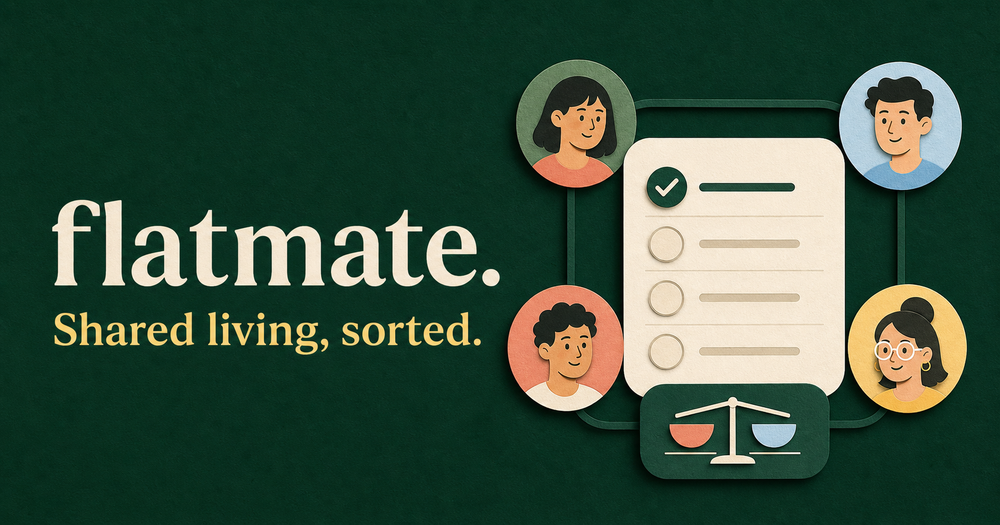

# Flatmate

Flatmate is a full-stack shared-home coordination application inspired by a real flatmate experience. It keeps duties, completion history, expense splits, balances, reminders, and member access clear without exposing private group activity to unrelated flatmates.



## What works

- Responsive React + TypeScript dashboard
- PostgreSQL-backed homes, members, groups, duties, and expenses
- Equal expense splitting with cent-safe remainder handling
- Add, edit, complete, and delete duties
- One-time, daily, weekly, and monthly duty schedules
- Private groups with nested subgroups and explicit membership
- Group-scoped duty access and notification recipients
- Automatic recurring duties with permanent completion history
- Delayed reminders plus optional desktop alerts while Flatmate is open
- Real-time house events over WebSockets
- Secure HTTP-only JWT session cookies
- Separate registration, login, logout, demo-session, and current-user flows
- Expiring, one-time invitation links for every new flatmate
- Immediate session revocation when a member is removed
- Persistent, per-member notification inboxes with read status
- Expense settlement with payer/member authorization and audit timestamps
- Optional Google sign-in for registered or invited Gmail accounts
- Optional invitation-email webhook with manual-link fallback
- Authentication rate limiting and hardened API security headers
- Primary/member role enforcement on sensitive member operations
- Redis/BullMQ notification processing
- Optional Kafka or AWS SQS event delivery
- Database health endpoint
- TypeORM production migration
- Jest unit tests and GitHub Actions CI

Every flatmate signs in with their own email and password. A primary member can invite a new flatmate, copy the private invitation link, and send it to that person. The invited person uses the link once to create their own password.

Completing a daily, weekly, or monthly duty stores a completion-history record, calculates the next future due date, and schedules the next reminder automatically. One-time duties remain completed. Expense shares can be marked paid by the owing member, payer, or a primary member.

For a quick local demo, choose **Open Monica demo** on the sign-in screen. The seeded accounts are `monica@example.com`, `rachel@example.com`, `phoebe@example.com`, `joey@example.com`, `ross@example.com`, and `chandler@example.com`; their development-only password is `Flatmate123!`.

## Architecture

```text
React/Vinext web app (port 3000)
              |
              | authenticated REST + HTTP-only cookie
              v
NestJS API (port 4000) ---- WebSocket house events
      |              |
      v              v
PostgreSQL       Redis + BullMQ
                     |
                     +---- Kafka (optional)
                     +---- AWS SQS (optional)
```

## Requirements

- Node.js 22.13 or newer
- npm
- Docker Desktop with the Linux engine running

## Run locally

### 1. Create local environment files

PowerShell:

```powershell
Copy-Item .env.example .env.local
Copy-Item .env.example server\.env
```

Change `JWT_SECRET` in `server/.env` to a private random value of at least 32 characters. Never commit that file.

### 2. Start PostgreSQL and Redis

```powershell
docker compose up -d postgres redis
docker compose ps
```

Wait until both services show as healthy.

### 3. Start the API

In a second terminal:

```powershell
cd server
npm install
npm run migration:run
npm run start:dev
```

Verify the API at `http://localhost:4000/api/v1/health`.

### 4. Start the web app

In a third terminal, from the project root:

```powershell
npm install
npm run dev
```

Open `http://localhost:3000`. The status pill changes to **API live** when the backend is connected.

The sign-in screen requires the API, PostgreSQL, and Redis to be running. This prevents local sample data from being confused with a real member account.

## Optional invitation emails

Invitation links always remain available for private manual sharing. To send them automatically, configure a trusted transactional-email webhook in `server/.env`:

```env
INVITATION_EMAIL_WEBHOOK_URL=https://your-email-service.example/send
INVITATION_EMAIL_WEBHOOK_TOKEN=your-private-webhook-token
MAIL_FROM=Flatmate <invites@your-domain.com>
```

Flatmate sends the webhook a JSON payload containing `from`, `to`, `subject`, `text`, and `html`. If delivery fails, creating the invitation still succeeds and the primary member can copy its one-time link.

## Optional Google sign-in

Create OAuth web credentials in Google Cloud, allow the callback URL, and add these values to `server/.env`:

```env
GOOGLE_CLIENT_ID=your-google-client-id
GOOGLE_CLIENT_SECRET=your-google-client-secret
GOOGLE_REDIRECT_URI=http://localhost:4000/api/v1/auth/google/callback
```

Then set this in `.env.local`:

```env
NEXT_PUBLIC_GOOGLE_AUTH_ENABLED=true
```

Google sign-in deliberately accepts only a Gmail address that has already registered a home or received a valid Flatmate invitation. It cannot be used to enter an unrelated apartment.

## Validation

Web:

```powershell
npm run build
node --test tests/rendered-html.test.mjs
```

API:

```powershell
cd server
npm run build
npm test -- --runInBand
```

## Production notes

- Set `NODE_ENV=production`, `COOKIE_SECURE=true`, and a strong `JWT_SECRET`.
- Run `npm run migration:run` in `server/` before starting the API.
- Use managed PostgreSQL and Redis services.
- Set `DATABASE_SSL=true` when required by the database provider.
- Restrict `WEB_URL` to the deployed frontend origin.
- Store all secrets in the deployment platform, never in source control.
- Keep `DEMO_MODE=false` in production.
- The API applies hardened response headers and an authentication rate limit; use a shared rate-limit store when running multiple API instances.

## Suggested AWS deployment

- Frontend: CloudFront/S3 or a compatible server-rendering platform
- API: ECS Fargate
- Database: RDS PostgreSQL
- Jobs/cache: ElastiCache Redis
- Events: MSK Kafka or SQS
- Secrets: AWS Secrets Manager

## Copyright and Usage

Copyright © 2026 Mansi Khand. All rights reserved.

This project is publicly available for portfolio and educational review only.
No permission is granted to copy, modify, distribute, sell, sublicense, or reuse
the original source code without written permission from the copyright owner.
